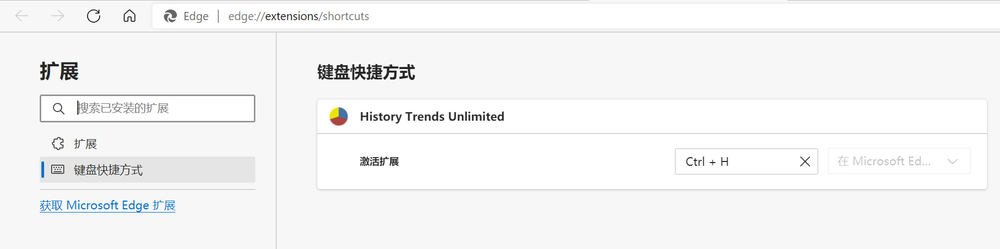

- ### [Tampermonkey](https://www.tampermonkey.net/)

  可以在任意网页运行用户自定义js脚本

    - #### [翻译插件](https://github.com/gjp0609/Scripts/blob/master/js/tampermonkey/translate.js)

      多源翻译，支持搜狗/百度/腾讯/彩云/谷歌/必应翻译

    - #### [Google结果跳转新标签](https://github.com/gjp0609/Scripts/blob/master/js/tampermonkey/google.js)

- ### [Stylus](https://github.com/openstyles/stylus/)

  自定义样式

- ### [SwitchyOmega](https://github.com/FelisCatus/SwitchyOmega)

  管理和切换代理配置

- ### [CORS Unblock](https://github.com/balvin-perrie/Access-Control-Allow-Origin---Unblock)

  解决本地页面CORS问题

- ### [uBlock Origin](https://github.com/gorhill/uBlock)

  广告拦截

- ### [History Trends Unlimited](https://chrome.google.com/webstore/detail/history-trends-unlimited/pnmchffiealhkdloeffcdnbgdnedheme)

  打开 `edge://extensions/shortcuts` 配置快捷键(Ctrl+H)，可以替代浏览器默认历史页面
  
