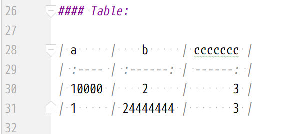

### Code:

```sql
-- sql
create table user
(
    id       integer not null primary key,
    username text
);


```

```js
// javascript
function render(key) {
    fetch('./md/' + key + '.md')
        .then((response) => response.text())
        .then((text) => {
            $('#marked').html(marked(text));
            linkOpenInNewTab();
            pangu.spacingElementById('marked-wrapper');
            setTimeout(() => loading(false), 200);
        });
}
```

### Title:

> # Level 1
>
> ## Level 2
>
> ### Level 3
>
> #### Level 4
>
> ##### Level 5
>
> ###### Level 6

### Table:

|  Port | Project | Service |
| ----: | :-----: | ------- |
|  8848 |    -    | nacos   |
|  9000 |    -    | redis   |
| 10000 |  club   |         |
| 10001 |         | order   |
| 10002 |         | member  |

### Link:

Visit [https://www.google.com/](https://www.google.com/) to know more.

### Image:



### Blockquote:

> ## Parent
>
> > ### child 1
> >
> > -   item 1
> > -   item 2
> >
> > ### child 2
> >
> > > #### child 2.1
> > >
> > > > ##### child 2.1.1
> > > >
> > > > > ###### child 2.1.1.1
> > > > >
> > > > > > ###### child 2.1.1.1.1
> > > > > >
> > > > > > ```java
> > > > > > new Object();
> > > > > > ```
